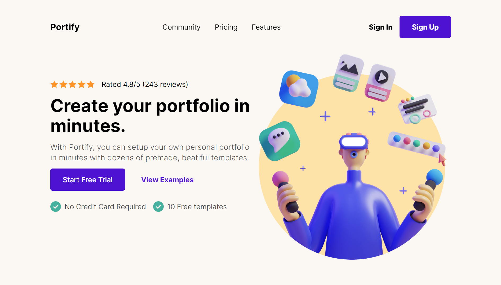
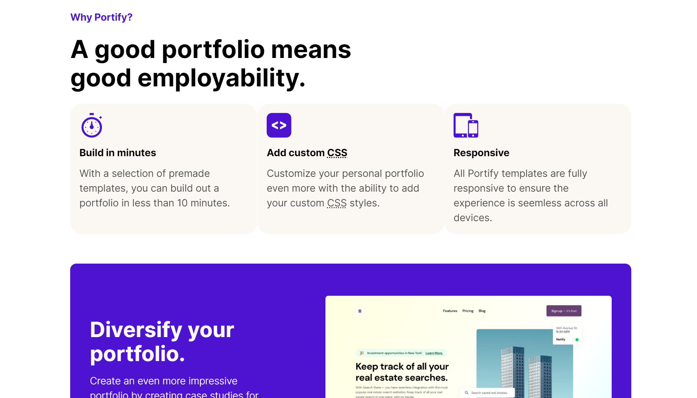
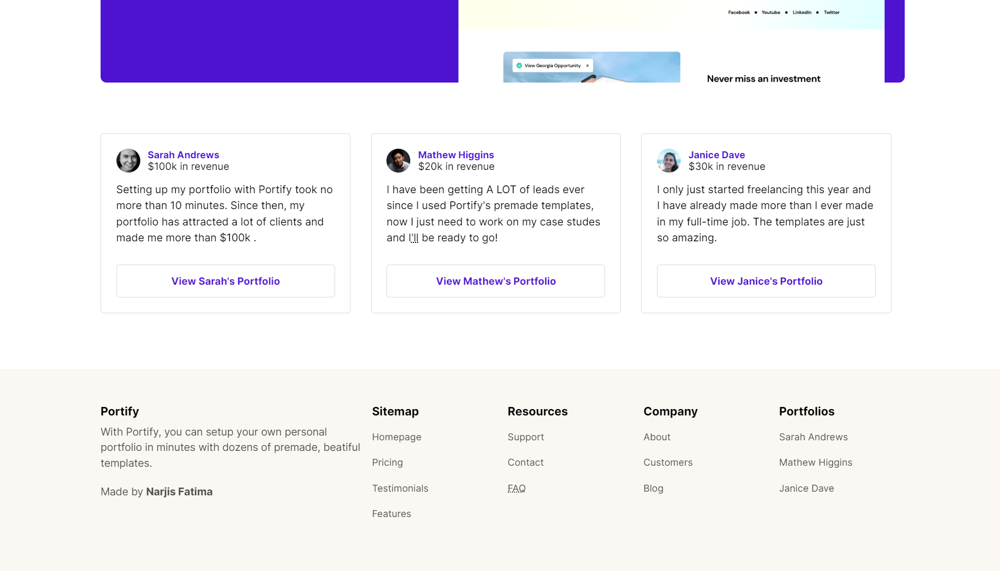
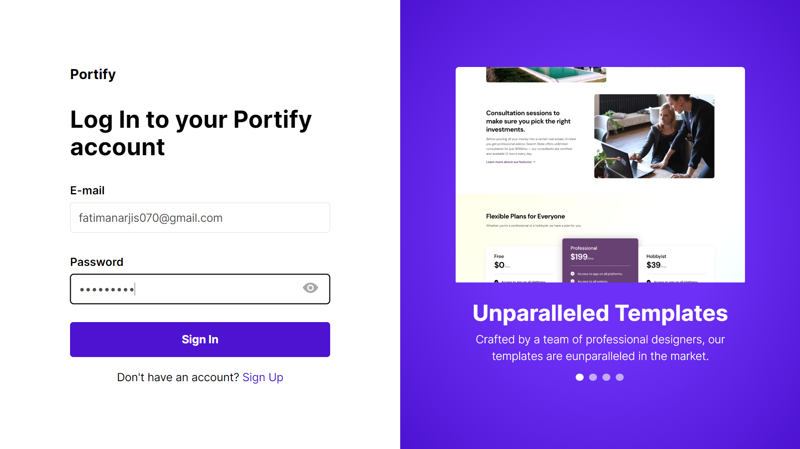
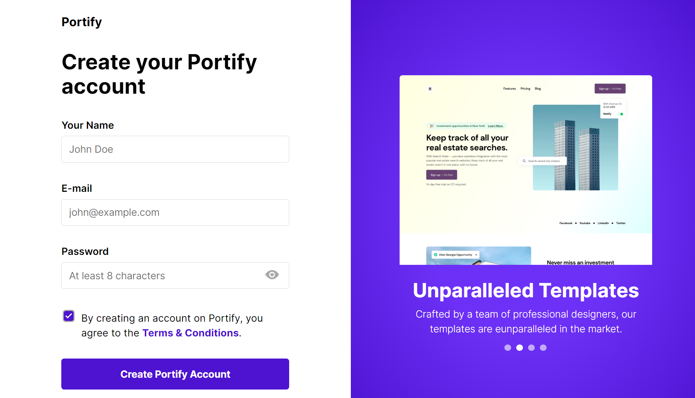

# 🌟 **Portify** - Your Portfolio Maker Landing Page 🎨  

Welcome to **Portify**! 🚀 A sleek and animated landing page designed to make creating stunning portfolios a breeze. Whether you're a developer, designer, or a creative professional, this project showcases how beautifully you can present your work online! ✨  

---

## 🎯 **Features**  
- 🌈 **Beautiful Design** - Crafted with a clean, modern, and minimalist approach.  
- 💫 **Animations with AOS** - Smooth scroll animations for an eye-catching experience.  
- 🛠️ **Built with HTML, CSS, JS** - Lightweight, fast, and responsive.  
- 📱 **Mobile-Responsive** - Looks amazing on all devices.  
- ⚡ **User-Friendly** - Easy to use and customize.  

---

## 📸 **Preview**  
🌐 **Live Demo:** [Portify Live](https://portifyn.vercel.app)  
Here's a sneak peek:  
### Hero Section

---

---
### Footer Section

---
### Login Page

---
### SignUp Page


---

## 💻 **Tech Stack**  
- 🧱 **HTML** - Structure of the page.  
- 🎨 **CSS** - Styling for the page.  
- 🪄 **JavaScript** - Adds interactivity and functionality.  
- ✨ **AOS (Animate on Scroll)** - Beautiful animations as you scroll.  

---

## 📂 **Folder Structure**  

```plaintext
portify/
├── index.html          # Main HTML file
├── style.css           # CSS for styling
├── script.js           # JavaScript for interactivity
├── assets/             # Images, icons, and other assets
└── README.md           # Project documentation
```  

---

## 🚀 **Getting Started**  

Follow these simple steps to get started with Portify:  

### 🛠️ Prerequisites  
- A code editor like VSCode.  
- Basic knowledge of HTML, CSS, and JS.  

### 📝 Installation  
1. Clone the repository:  
   ```bash  
   git clone https://github.com/narjisfatima169/portify.git  
   ```  
2. Open the project folder:  
   ```bash  
   cd portify  
   ```  
3. Open `index.html` in your browser or use a live server.  

---

## 🌟 **Usage**  

1. Customize the `index.html` file with your personal details.  
2. Replace placeholder images in the `assets/` folder with your own.  
3. Edit styles in `style.css` to match your branding.  
4. Tweak animations using AOS library settings in `script.js`.  

---

## ✨ **Animations with AOS**  

**AOS (Animate on Scroll)** library brings your page to life! Add animations like these:  
```html  
<div data-aos="fade-up">Your Content</div>  
```  
### 💡 Customize Animations  
- Learn more: [AOS Documentation](https://michalsnik.github.io/aos/).  

---

## 🛡️ **Contributing**  
Contributions are welcome! 💖  
1. Fork the project.  
2. Create a new branch (`feature/your-feature`).  
3. Commit your changes (`git commit -m 'Add your feature'`).  
4. Push to the branch (`git push origin feature/your-feature`).  
5. Open a pull request.  

---

## 📋 **To-Do**  

- [ ] Add Dark Mode. 🌙  
- [ ] Integrate a form for portfolio submissions. ✍️  
- [ ] Add more animations and effects. 🌀  

---

## 📞 **Contact**  

Got questions? Feel free to reach out!  
- **Creator:** [Narjis Fatima](https://github.com/narjisfatima169)  
- **Email:** fatimanarjis070@gmail.com
- **LinkedIn:** [Narjis Fatima](https://www.linkedin.com/in/narjisfatimaa/)  

---

## 🌟 **Show Your Support**  
Give a ⭐️ if you like this project!  

---

## 📜 **License**  
This project is licensed under the MIT License. 📝  

---

🎉 **Happy Portifying!** 🚀  